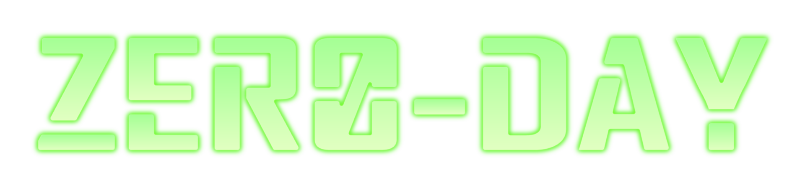

# ZERO-DAY CTF Challenges Collection

This repository contains a set of Capture The Flag (CTF) challenges that I designed for a ZERO-DAY CTF competition organized by SLTC UNIVERSITY. The challenges cover multiple cybersecurity domains and are intended to test participants’ skills in cryptography, reverse engineering, Android analysis, and digital forensics.

## 🧩 Challenges

### 1. XORWare (Easy – Crypto)

A beginner-friendly cryptography challenge focused on breaking a simple XOR-based encryption scheme. Participants need to analyze the encrypted data and recover the original message.

### 2. The Identity Gate (Medium – Reverse Engineering)

A reverse engineering challenge where participants must analyze a compiled program to understand its authentication logic and bypass the identity verification mechanism.

### 3. Operation Black Sun (Hard – Android Reverse Engineering)

A challenging Android reverse engineering task. Participants need to analyze the APK, inspect its code and logic, and uncover the hidden flag through static or dynamic analysis.

### 4. Billie’s Story (Hard – Digital Forensics)

A forensic investigation challenge involving analyzing digital artifacts to uncover hidden information and reconstruct what happened.

## 🎯 Goal

The purpose of these challenges is to help learners and CTF players practice real-world cybersecurity skills such as:

* Cryptanalysis
* Binary Reverse Engineering
* Android Application Analysis
* Digital Forensics Investigation

## 📂 Repository Structure

Each challenge has its own directory containing:

* Challenge files
* Supporting resources

## ⚠️ Disclaimer

These challenges are created strictly for **educational and training purposes**. Do not use these techniques on systems or applications without proper authorization.

---

If you enjoy these challenges or find them useful for practice, feel free to ⭐ the repository
